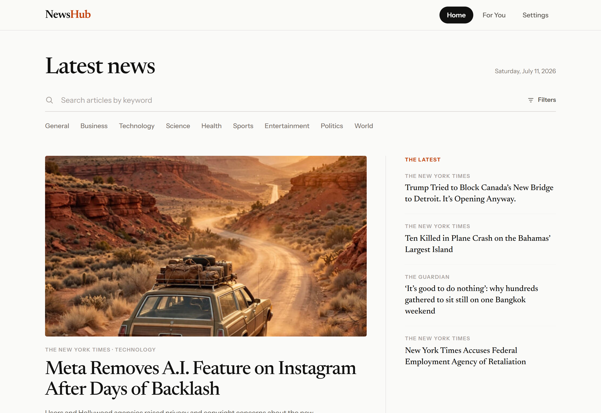
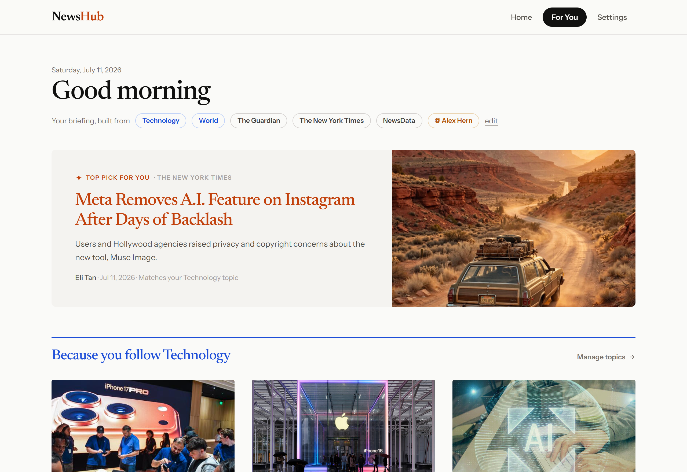
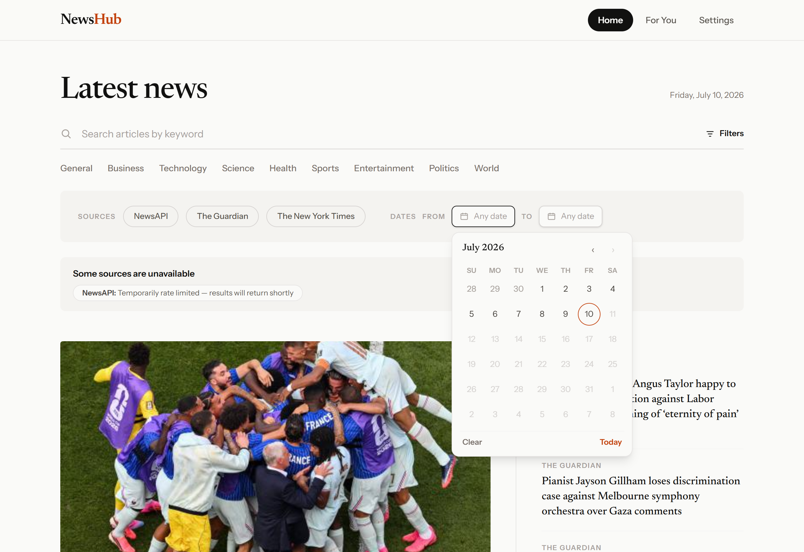
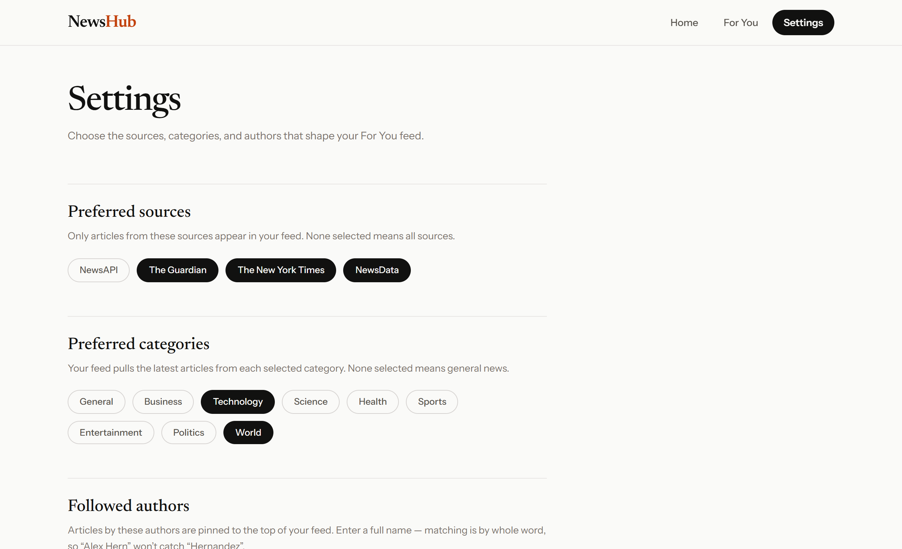
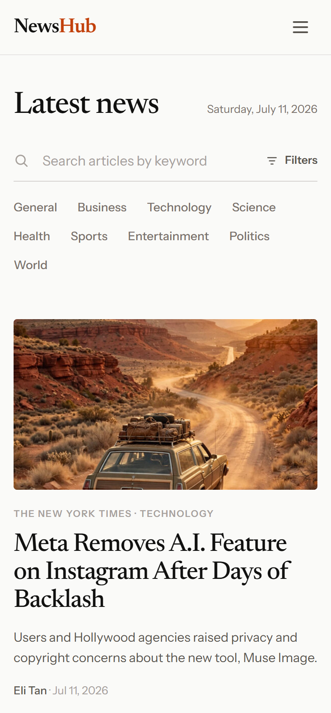

<div align="center">

# NewsHub

**A news aggregator that pulls headlines from The Guardian, The New York Times, and NewsAPI into one clean, editorial reading experience — with keyword search, rich filtering, and a personalized feed.**




<sub>The editorial front page. The "Some sources are unavailable" panel is not a bug — it is the app's **graceful degradation** at work: NewsAPI's free tier only allows browser requests from localhost, so when it is rate‑limited the other sources keep rendering and the affected one becomes a status chip.</sub>

</div>

---

## Table of contents

- [Overview](#overview)
- [Requirement coverage](#requirement-coverage)
- [Screenshots](#screenshots)
- [Features](#features)
- [Tech stack](#tech-stack)
- [Getting started](#getting-started)
  - [Prerequisites](#prerequisites)
  - [1. Get API keys](#1-get-api-keys-all-free)
  - [2. Configure the environment](#2-configure-the-environment)
  - [3. Run locally](#3-run-locally)
  - [4. Run with Docker](#4-run-with-docker)
  - [Available scripts](#available-scripts)
- [Architecture & design](#architecture--design)
  - [High-level flow](#high-level-flow)
  - [The data layer: adapters, aggregator, registry](#the-data-layer-adapters-aggregator-registry)
  - [Request lifecycle](#request-lifecycle)
  - [State management](#state-management)
  - [Project structure](#project-structure)
  - [Extending: adding a source](#extending-adding-a-source)
- [Design decisions & rationale](#design-decisions--rationale)
  - [Choice of data sources](#choice-of-data-sources)
  - [Data layer](#data-layer-decisions)
  - [State & data fetching](#state--data-fetching-decisions)
  - [Product & UX](#product--ux-decisions)
  - [Engineering & tooling](#engineering--tooling-decisions)
  - [Build & deployment](#build--deployment-decisions)
- [Why this project is strong](#why-this-project-is-strong)
- [Testing](#testing)
- [Known limitations](#known-limitations)

---

## Overview

NewsHub is a single-page React application that aggregates articles from three
independent news providers and presents them as one coherent, newspaper-styled
product. It was built against a front-end brief with seven requirements:
keyword **search** with date/category/source **filtering**, a **personalized
feed**, **mobile-responsive** design, a **React + TypeScript** stack, **at
least three data sources**, a **Dockerized** build with clear docs, and clean
**DRY / KISS / SOLID** code.

Rather than stopping at a functional list of cards, NewsHub treats the news
domain seriously: a magazine front page for browsing, a relevance-first flat
list for searching, a segmented "For You" briefing for personalization, and an
in-app reader for the articles themselves — all sharing one editorial design
language.

## Requirement coverage

| #   | Requirement                                                  | Where it is implemented                                                                             |
| --- | ------------------------------------------------------------ | --------------------------------------------------------------------------------------------------- |
| 1   | Article search & filtering (keyword, date, category, source) | `SearchBar`, `CategoryTabs`, `FiltersPanel`, `DatePicker`; state in `useSearchFilters` (URL-driven) |
| 2   | Personalized feed (sources, categories, authors)             | `/for-you` page + `/settings`; `useForYouFeed`, `PreferencesProvider`, `localStorage` persistence   |
| 3   | Mobile-responsive design                                     | Tailwind breakpoints throughout; hamburger nav, collapsing grids, viewport-clamped date picker      |
| 4   | React + TypeScript                                           | React 19 + TypeScript in `strict` mode, zero `any`                                                  |
| 5   | ≥ 3 data sources                                             | NewsAPI.org, The Guardian, The New York Times (adapters in `src/services/news/adapters/`)           |
| 6   | Dockerized + documentation                                   | Multi-stage `Dockerfile`, `docker-compose.yml`, `nginx.conf`; this README                           |
| 7   | DRY / KISS / SOLID                                           | Adapter + aggregator + registry pattern, dependency inversion, provider-agnostic domain layer       |

## Screenshots

|                                                  Personalized "For You" feed                                                  |                                         In-app reader                                          |
| :---------------------------------------------------------------------------------------------------------------------------: | :--------------------------------------------------------------------------------------------: |
|                                                                                                   |                                                                      |
| A time-of-day greeting, persona chips, a top pick, and "Because you follow …" sections, all shaped by your saved preferences. | A centred reading view with byline avatar, wide figure, and a link back to the original story. |

|                                  Search, source & date filtering                                  |                                     Preferences (Settings)                                      |
| :-----------------------------------------------------------------------------------------------: | :---------------------------------------------------------------------------------------------: |
|                                                       |                                                                   |
| Multi-select source pills and a themed, keyboard-navigable calendar that caps selection at today. | Pick the sources, categories, and authors that shape the For You feed; saved to `localStorage`. |

<div align="center">

**Responsive by design** — the layout reflows to a single column with a hamburger menu on mobile.



</div>

## Features

### Search & filtering

- **Keyword search** across every configured source, debounced (400 ms) to stay
  within provider rate limits.
- **Filter by category** via multi-select tabs, **by source** via pills, and
  **by date range** via a custom calendar that cannot select a future date.
- **Filter state lives in the URL** — searches are shareable and bookmarkable,
  survive a refresh, and the browser back button walks through filter history.

### Personalized feed

- A dedicated **For You** page assembled from your preferred **sources**,
  **categories**, and **followed authors**, configured on the **Settings** page
  and persisted in `localStorage`.
- Articles by followed authors are **pinned to the top** of the feed in a
  highlighted section, so a favourite byline is never buried.
- The feed is presented as a **briefing**: greeting, persona chips summarising
  what it is built from, a highlighted top pick, a "Because you follow X" topic
  spotlight, and per-source digests.

### Mobile-responsive design

- The article grid collapses 3 → 2 → 1 columns, the header switches to a
  hamburger menu, and the filter controls and date picker reflow and clamp to
  the viewport on small screens.

### Editorial extras

- **Magazine front page** — browsing (no keyword) is laid out like a
  newspaper: a lead-story package beside a rail of latest headlines, per-category
  sections under coloured rules, a dark "Top headlines" box, and an "Earlier
  this week" tail. An active search collapses this to a flat, relevance-first
  list.
- **Infinite scroll** — both feeds load more as you approach the bottom
  (an `IntersectionObserver` sentinel drives `fetchNextPage`), with an
  "all caught up" divider at the end. No "load more" button.
- **In-app reader** — Guardian articles render their full body (fetched by
  content id and sanitized with DOMPurify); other providers expose only
  summaries, so those pages show everything available plus a link to the source.
- **Graceful degradation** — every source is fetched independently. One that is
  down, rate-limited, or missing a key becomes a warning chip while the rest of
  the page renders.
- **Cross-source dedupe** — NewsAPI indexes `theguardian.com` and `nytimes.com`,
  so the same story can arrive twice; duplicates are dropped by URL and title.

## Tech stack

| Layer                | Choice                                                      |
| -------------------- | ----------------------------------------------------------- |
| UI                   | React 19, React Router v7                                   |
| Language             | TypeScript (strict)                                         |
| Build tool           | Vite 8                                                      |
| Styling              | Tailwind CSS v4 (`@theme` tokens, no PostCSS)               |
| Server state         | TanStack Query v5 (infinite queries, caching, cancellation) |
| Sanitization         | DOMPurify (Guardian article bodies)                         |
| Testing              | Vitest + React Testing Library (96 tests)                   |
| Linting / formatting | oxlint + Prettier                                           |
| Runtime image        | nginx (Alpine), served from a multi-stage Docker build      |

---

## Getting started

### Prerequisites

- **Node.js 20+** and npm (for local development), **or**
- **Docker** (for the containerized build).

### 1. Get API keys (all free)

The app runs with **any subset** of keys — sources without a key are skipped
and flagged in the UI — but all three give the full experience.

| Provider       | Register at                                     | Notes                                                                                                            |
| -------------- | ----------------------------------------------- | ---------------------------------------------------------------------------------------------------------------- |
| NewsAPI.org    | <https://newsapi.org/register>                  | The free _Developer_ plan only allows browser requests **from localhost** — fine for local dev and local Docker. |
| The Guardian   | <https://open-platform.theguardian.com/access/> | Register for a _developer_ key; it arrives by email.                                                             |
| New York Times | <https://developer.nytimes.com/get-started>     | Create an app and **enable the "Article Search API"** for it.                                                    |

### 2. Configure the environment

```bash
cp .env.example .env
# then fill in the three VITE_* keys
```

```dotenv
VITE_NEWSAPI_API_KEY=your_key
VITE_GUARDIAN_API_KEY=your_key
VITE_NYT_API_KEY=your_key
```

### 3. Run locally

```bash
npm install
npm run dev          # http://localhost:5173
```

### 4. Run with Docker

**With Docker Compose** (reads the keys from `.env` automatically):

```bash
docker compose up --build     # http://localhost:8080
```

**With plain Docker** (pass keys as build args):

```bash
docker build -t news-aggregator \
  --build-arg VITE_NEWSAPI_API_KEY=your_key \
  --build-arg VITE_GUARDIAN_API_KEY=your_key \
  --build-arg VITE_NYT_API_KEY=your_key .

docker run --rm -p 8080:80 news-aggregator
```

The image is a **multi-stage build**: Node compiles the app, then nginx (Alpine)
serves the static bundle (~74 MB final image). The nginx layer adds an SPA
fallback so deep links like `/for-you` resolve on a hard refresh, gzip
compression, long-lived immutable caching for hashed assets, `no-cache` for the
app shell, baseline security headers, and a `/healthz` endpoint wired to a
Docker `HEALTHCHECK`.

### Available scripts

```bash
npm run dev            # start the Vite dev server
npm run build          # type-check (tsc) + production build
npm run test           # unit tests (Vitest + React Testing Library)
npm run lint           # oxlint
npm run format         # Prettier (write); format:check to verify
npm run preview        # preview the production build locally
```

---

## Architecture & design

The core idea is **dependency inversion around a `NewsSource` interface**. The
UI and the aggregator never touch a provider's SDK or response shape — they
depend only on a provider-agnostic contract and a normalized `Article` domain
type. Every provider quirk is absorbed at the edge, in a small adapter.

### High-level flow

```
        ┌──────────────────────────────────────────────────────┐
        │  Pages / Components  (HomePage, ForYouPage, Reader…)   │
        └───────────────┬──────────────────────────────────────┘
                        │  React Query hooks
        ┌───────────────▼──────────────────────────────────────┐
        │  Hooks  (useArticleSearch, useForYouFeed, …)          │
        └───────────────┬──────────────────────────────────────┘
                        │  fetchAggregated / fetchAcrossCategories
        ┌───────────────▼──────────────────────────────────────┐
        │  aggregator.ts                                         │
        │  • fans a query out to eligible sources               │
        │  • Promise.allSettled → per-source failure isolation  │
        │  • merges + dedupes (URL, title) + orders results     │
        └───┬───────────────────┬───────────────────┬──────────┘
            ▼                   ▼                   ▼
   ┌────────────────┐  ┌────────────────┐  ┌────────────────┐
   │ NewsApiSource  │  │ GuardianSource │  │ NytimesSource  │   ← adapters,
   │  (adapter)     │  │  (adapter)     │  │  (adapter)     │     each a
   └───────┬────────┘  └───────┬────────┘  └───────┬────────┘     NewsSource
           ▼                   ▼                   ▼
     NewsAPI.org         The Guardian          NYT Article
   /everything +        Open Platform          Search API
   /top-headlines
```

### The data layer: adapters, aggregator, registry

- **`src/domain/`** — provider-agnostic types the whole app speaks: `Article`,
  `ArticleQuery`, `ArticlePage`, the `Category` vocabulary, and `Preferences`.
  The UI only ever sees these.
- **`NewsSource.ts`** — the contract every adapter implements. Crucially it
  includes a **capability declaration** (`SourceCapabilities`): which categories
  a source supports, whether it can filter by date, and whether date and
  category filters combine in a single request. This lets the aggregator handle
  provider differences _honestly_ instead of guessing or assuming a lowest
  common denominator.
- **`HttpNewsSource.ts`** — an abstract base class that owns everything every
  HTTP/JSON provider shares: credential storage, `isConfigured()`, and the
  fetch → map flow. A concrete source implements only two hooks — `buildRequest`
  (turn a query into a URL + auth headers) and `parseResponse` (turn the raw
  envelope into a domain page). This is what keeps the adapters tiny.
- **`adapters/<provider>/`** — one folder per provider, each with a `*Source.ts`
  that extends `HttpNewsSource` (plus an exported request-builder used in
  tests), a pure response-to-domain mapper (`mapArticle.ts`), and raw response
  types (`types.ts`). Mappers absorb every quirk: NewsAPI's `[Removed]` ghost
  entries, Guardian's trailing HTML, NYT's relative image URLs and `"By "`
  bylines.
- **`aggregator.ts`** — `fetchAggregated` fans a query out to eligible sources
  with `Promise.allSettled`, then merges, dedupes, and orders the results;
  `fetchAcrossCategories` handles multi-category feeds; failures become
  per-source `SourceError`s rather than a broken page.
- **`registry.ts`** — the **single source of truth for source identity**: the
  list of installed sources (`ALL_SOURCES`, each paired with its API key), plus
  `getEffectiveSources()` for a selection and the `getKnownSourceIds()` /
  `isKnownSourceId()` / `getSourceLabel()` helpers the rest of the app uses
  instead of any hardcoded source list or label map.

### Request lifecycle

1. A hook builds an `ArticleQuery` (keyword, category, dates, page) from URL
   filters or saved preferences.
2. `fetchAggregated` asks the registry for eligible sources and **skips any that
   cannot honor the query** (per capabilities) or lack a key.
3. Each eligible source's adapter translates the query into a provider request,
   fetches, and maps the response into `Article[]`.
4. The aggregator merges the pages, drops duplicates, orders them
   (**relevance-first for searches, newest-first for browsing**), and returns
   any per-source errors alongside the results.
5. TanStack Query caches the page (5 min), dedupes in-flight requests, and
   drives pagination for infinite scroll.

### State management

There is deliberately **no global store**. State lives where it belongs:

- **Server state** → TanStack Query (caching, cancellation, request dedup,
  infinite pagination).
- **Filter state** → the **URL** (`useSearchFilters` parses and validates search
  params), making searches shareable and refresh-proof.
- **User preferences** → a small React context (`PreferencesProvider`) backed by
  validated, versioned `localStorage` persistence.

### Project structure

```
src/
├── domain/                # Provider-agnostic types (Article, Category, Preferences)
├── services/
│   ├── news/
│   │   ├── NewsSource.ts      # The adapter contract + capabilities
│   │   ├── HttpNewsSource.ts  # Abstract base for HTTP/JSON providers
│   │   ├── aggregator.ts      # Fan-out, merge, dedupe, order, error-isolate
│   │   ├── registry.ts        # Installed sources + keys, identity & labels
│   │   ├── topHeadlines.ts    # "Top headlines" box (source-agnostic)
│   │   └── adapters/
│   │       ├── newsapi/       # newsApiSource.ts · mapArticle.ts · types.ts
│   │       ├── guardian/
│   │       └── nytimes/
│   └── preferences/        # Validated localStorage persistence
├── context/               # PreferencesProvider (preferences state)
├── hooks/                 # useSearchFilters, useForYouFeed, useInfiniteScroll, …
├── pages/                 # HomePage, ForYouPage, SettingsPage, ArticlePage
├── components/            # Presentational layer (articles/, search/, layout/, …)
├── lib/                   # Pure helpers (formatDate, categorySections, …)
└── test/                  # Unit tests mirroring src, plus response fixtures
```

### Extending: adding a source

The app is **source-agnostic**: nothing outside an adapter names a specific
provider. Sources are identified by a plain string, validated and labelled at
runtime from the registry, so a new provider needs **no changes to the domain
types, the aggregator, the hooks, or any component**. Adding an HTTP/JSON source
is three steps:

1. **Key** — add `VITE_X_API_KEY` to `.env` / `.env.example`, plus the matching
   build `ARG` in the `Dockerfile` and `docker-compose.yml` (Docker builds and
   Vite both resolve env at build time).
2. **Adapter** — create `src/services/news/adapters/x/` with `xSource.ts`
   (extends `HttpNewsSource`, implements `buildRequest` + `parseResponse`),
   `mapArticle.ts`, and `types.ts`.
3. **Register** — one line in `registry.ts`.

```ts
// xSource.ts — a complete source is just identity + two hooks
export class XSource extends HttpNewsSource<XResponse> {
  readonly id = 'x'
  readonly name = 'X News'
  readonly capabilities = { categories: [...], dateFilter: true, dateFilterWithCategory: true }

  protected buildRequest(query: ArticleQuery): SourceRequest {
    return { url: buildXRequestUrl(query, this.apiKey) }
  }
  protected parseResponse(raw: XResponse, query: ArticleQuery): ArticlePage {
    return { articles: raw.docs.map((d) => mapXArticle(d, query.category)), ... }
  }
}

// registry.ts — the only shared line that changes
export const ALL_SOURCES: NewsSource[] = [
  new NewsApiSource(readKey(import.meta.env.VITE_NEWSAPI_API_KEY)),
  new GuardianSource(readKey(import.meta.env.VITE_GUARDIAN_API_KEY)),
  new NytimesSource(readKey(import.meta.env.VITE_NYT_API_KEY)),
  new XSource(readKey(import.meta.env.VITE_X_API_KEY)), // ← add the source
]
```

A source can opt into extras through optional `NewsSource` methods:
`fetchFullArticle` (render the full body in-app, as the Guardian does) or
`fetchTopHeadlines` (power the front-page ranked box). Non-JSON providers
(RSS/XML) slot in as a sibling base class — the `NewsSource` interface doesn't
assume JSON.

---

## Design decisions & rationale

Every non-trivial decision, and why it was made.

### Choice of data sources

The brief lists seven sources and asks for at least three. Three of the seven
have free, self-service public APIs, and those are the three used here.

| Source                                  | Why it was chosen                                                                                                                               |
| --------------------------------------- | ----------------------------------------------------------------------------------------------------------------------------------------------- |
| **NewsAPI.org**                         | Aggregates 150k+ outlets; supports keyword, date, and category queries. (The brief's "NewsAPI" and "NewsAPI.org" entries are the same product.) |
| **The Guardian** (Open Platform)        | The best-behaved API of the set — keyword, section, and date filters all compose in a single request.                                           |
| **The New York Times** (Article Search) | Full-archive keyword search with date and section filtering.                                                                                    |

The remaining options were ruled out **deliberately**: **OpenNews** is a
journalism community, not an article API; **NewsCred** is an enterprise product
with no self-service access; **BBC News** has no official public API.

### Data layer decisions

| Decision                                                | Why                                                                                                                                                                                                                                                       |
| ------------------------------------------------------- | --------------------------------------------------------------------------------------------------------------------------------------------------------------------------------------------------------------------------------------------------------- |
| **Source-adapter pattern** (one adapter per provider)   | Isolates every provider's request format and response quirks behind a single interface, so the rest of the app is provider-agnostic (SOLID: single responsibility, dependency inversion).                                                                 |
| **`HttpNewsSource` abstract base class**                | Every HTTP/JSON provider shares the same credential + fetch → map flow. The base owns it (template method); a source implements only `buildRequest` + `parseResponse`, so adding one means writing intent, not boilerplate.                               |
| **Registry-driven identity (no hardcoded source list)** | `SourceId` is a plain string; the installed sources define what's valid (`isKnownSourceId`) and how it's labelled (`getSourceLabel`) at runtime. Nothing outside an adapter names a provider, so the app stays source-agnostic and scalable.              |
| **Capability declaration per source**                   | Providers genuinely differ (NewsAPI can't combine date + category; supports fewer categories). Declaring capabilities lets the aggregator send only queries a source can honor — honest results instead of a lowest-common-denominator or silent empties. |
| **Aggregator uses `Promise.allSettled`**                | One slow, rate-limited, or unkeyed provider must never break the page. Failures are isolated into per-source error chips (graceful degradation).                                                                                                          |
| **Cross-source dedupe by URL + title**                  | NewsAPI re-indexes Guardian and NYT content, so the same story arrives twice; dedupe keeps the feed clean.                                                                                                                                                |
| **Relevance-first for search, newest-first for browse** | A searcher wants the most relevant match; a browser wants the latest news. The aggregator orders each mode to match intent (searches keep provider relevance ranking, then break ties toward newer).                                                      |
| **A normalized `Article` domain type**                  | Gives the UI one stable shape to render, decoupled from any provider's JSON.                                                                                                                                                                              |

### State & data fetching decisions

| Decision                                           | Why                                                                                                                                                          |
| -------------------------------------------------- | ------------------------------------------------------------------------------------------------------------------------------------------------------------ |
| **URL-driven filter state** (not component state)  | Shareable and bookmarkable links, a working back button, refresh-proof searches, and one source of truth.                                                    |
| **TanStack Query for server state**                | Purpose-built for caching, cancellation, request dedup, and infinite pagination — far less error-prone than hand-rolled `useEffect` fetching.                |
| **No global store (Redux/Zustand)**                | Nothing here needs cross-cutting client state. Server state is Query's job; filters live in the URL; preferences in a tiny context (KISS).                   |
| **`localStorage` + versioned key for preferences** | Preferences must survive reloads without a backend. A versioned key and validation-on-read make the stored shape safe to evolve and resistant to corruption. |
| **Debounced search (400 ms) + 5-minute cache**     | Keeps request volume within the free tiers, which matters most for NYT (~5 requests/minute).                                                                 |
| **Infinite scroll via `IntersectionObserver`**     | A sentinel that triggers `fetchNextPage` is smoother and more modern than a "load more" button, and keeps the reading flow uninterrupted.                    |

### Product & UX decisions

| Decision                                                | Why                                                                                                                                                                                                                                                                                                        |
| ------------------------------------------------------- | ---------------------------------------------------------------------------------------------------------------------------------------------------------------------------------------------------------------------------------------------------------------------------------------------------------- |
| **Editorial / magazine design language**                | A news product should read like one. Newsreader (serif) for headlines + Instrument Sans for UI, a warm paper palette, and coloured category rules make the content feel considered rather than like a generic card grid.                                                                                   |
| **Magazine front page vs. flat search list**            | Browsing and searching are different intents: browsing gets a hierarchical front page (lead package, sections, top box); an active search collapses to a flat, relevance-first list where ranking matters most.                                                                                            |
| **Author preferences _partition_ rather than _filter_** | No free tier supports querying by author, and any single result page rarely contains a specific byline — a hard filter would usually render an empty feed. Instead, followed authors' articles are pinned above the rest.                                                                                  |
| **Settings affect only "For You", not "Home"**          | Home is the neutral, everything view; For You is the personalized one. Keeping preferences scoped to For You keeps each page's purpose predictable.                                                                                                                                                        |
| **Custom, themed date picker** (not the native input)   | The native control can't match the editorial theme, can't be capped at "today" consistently across browsers, and is inconsistent on mobile. The custom picker is theme-matched, caps at today, is keyboard-navigable (`role="grid"`, roving tabindex), and clamps itself to the viewport on small screens. |
| **In-app reader with full Guardian bodies**             | Keeps readers in the app where the provider allows it. Guardian bodies are fetched by content id and **sanitized with DOMPurify**; providers that only expose summaries show everything available plus a link to the original.                                                                             |
| **Global pointer cursor on interactive elements**       | Small affordance detail — every clickable control signals that it is clickable.                                                                                                                                                                                                                            |

### Engineering & tooling decisions

| Decision                                            | Why                                                                                                                                         |
| --------------------------------------------------- | ------------------------------------------------------------------------------------------------------------------------------------------- |
| **React + TypeScript in `strict` mode, zero `any`** | Type safety across provider boundaries catches mapping mistakes at compile time; the brief also asks for TypeScript.                        |
| **Vite**                                            | Fast dev server, native ESM, first-class TypeScript, and a simple production build.                                                         |
| **Tailwind CSS v4 with `@theme` tokens**            | Utility-first styling with the design system expressed as CSS custom properties (colours, fonts) — no separate PostCSS config to maintain.  |
| **Vitest + React Testing Library**                  | Tests the parts with real logic — mappers, request building, the aggregator, storage, URL state — behaviourally, close to how the app runs. |
| **oxlint + Prettier**                               | Fast linting and consistent formatting, enforced as part of the workflow.                                                                   |

### Build & deployment decisions

| Decision                                                                                  | Why                                                                                                                                                                                                                                          |
| ----------------------------------------------------------------------------------------- | -------------------------------------------------------------------------------------------------------------------------------------------------------------------------------------------------------------------------------------------- |
| **Build-time API keys** (`VITE_*` inlined into the bundle)                                | Simplest path for a client-only take-home on free-tier, localhost-scoped keys. The trade-off is explicit and documented (see _Known limitations_); a production build would front the providers with a thin proxy so keys stay server-side.  |
| **Multi-stage Docker (Node build → nginx serve)**                                         | Ships only the static bundle on a tiny Alpine nginx image (~74 MB), not the toolchain.                                                                                                                                                       |
| **nginx: SPA fallback + gzip + immutable asset caching + security headers + healthcheck** | Production-grade static serving: deep links resolve on refresh, text assets are compressed, content-hashed assets cache forever while the shell stays fresh, baseline security headers are set, and `/healthz` backs a Docker `HEALTHCHECK`. |

---

## Why this project is strong

- **Real domain modelling, not a fetch-and-map demo.** A provider-agnostic
  domain layer and a capability-aware aggregator mean the app handles the _real_
  differences between three APIs honestly — different categories, different
  filter combinations, different failure modes.
- **Genuinely resilient.** Per-source failure isolation means a rate-limited or
  down provider degrades to a chip; the page always renders something useful.
- **Intent-aware UX.** Browsing, searching, and personalization each get a
  layout that fits what the user is trying to do, unified by one design system.
- **Source-agnostic by construction.** A new source is one adapter (two methods
  on `HttpNewsSource`) plus one registry line; identity, validation, and labels
  resolve from the registry at runtime, so nothing outside an adapter names a
  provider — the open–closed principle in practice, demonstrated above.
- **Trustworthy state.** Filters in the URL and validated, versioned preference
  storage make the app shareable, refresh-proof, and forward-compatible.
- **Tested where it counts.** 96 tests cover the mappers, request building, the
  aggregator's merge/dedupe/order/skip logic, storage, and URL state.
- **Accessible details.** Keyboard-navigable date picker with focus management,
  semantic roles, and consistent affordances.
- **Ships clean.** A warning-free, multi-stage Docker build with a hardened
  nginx layer, and this documentation.

## Testing

`npm run test` runs **96 tests across 17 files**, covering the parts with real
logic:

- each adapter's **mapper** against realistic response fixtures (removed
  entries, HTML stripping, image-URL prefixing, byline normalization, both NYT
  multimedia schemas),
- each adapter's **request building** (endpoint selection, date reformatting,
  pagination conversion, no key leakage into URLs),
- the **`HttpNewsSource` base-class contract** (a `FakeSource` proving the
  `buildRequest` → fetch → `parseResponse` flow, credential handling, and header
  passing — doubling as proof that a new source is trivial to add),
- the **aggregator** (merging, sorting, dedupe, capability skipping, failure
  isolation),
- **preferences storage** (round-trip, corruption fallback, invalid-entry
  filtering),
- **URL filter state** (parsing, validation, round-trip serialization) and
  followed-author matching,
- **key components** (article card rendering, app routing).

## Known limitations

- **NewsAPI free tier is localhost-only in browsers.** It works in local dev and
  local Docker, but a deployed build would need the proxy described above.
  Free-tier articles also arrive with a ~24 h delay.
- **NYT rate limits are tight** (~5 requests/minute). The 5-minute cache and
  debounced search absorb normal usage; hammering filters can briefly surface a
  "rate limited" chip.
- **Category vocabularies differ per provider** and are mapped to a unified set;
  the mapping is intentionally approximate in places (e.g. Guardian `society` →
  _Health_, NYT `Arts` → _Entertainment_).
- **NewsAPI date-only filtering** falls back to a broad keyword because its
  `/everything` endpoint requires a query term.
- **Selecting many categories multiplies requests** (one per category per
  source), so a large selection can briefly trip the NYT rate limit — it
  degrades to a warning chip while the other sources keep rendering.
- **"Top headlines" is a per-source capability** (`fetchTopHeadlines`), and of
  the three bundled providers only NewsAPI exposes a cross-outlet ranking, so
  the box shows its biggest stories — not a global, cross-source popularity
  ranking. Any future source that offers one can power the box instead.
